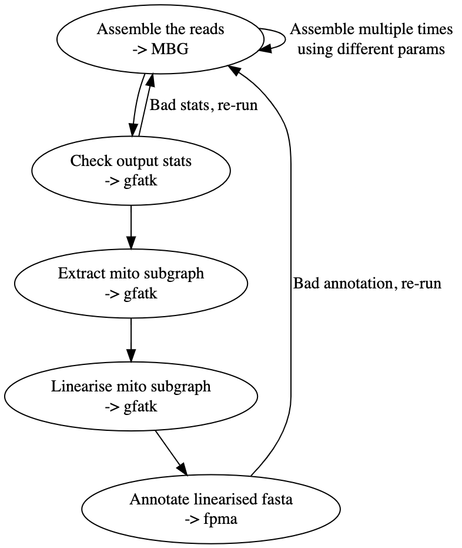

# pm/o-gap

Plant mitochondrial/organelle genome assembly pipeline.

     

A draft attempt to produced a finished plant mitochondrial assembly from raw reads.

The required input for the pipeline (list to be finalised):
- raw reads (fa/fa.gz)

## Pipeline

- Assemble the reads using MBG.
  - Might be worth assembling multiple times with different parameters anyway from the start. 
- Check the statistics of the output GFA.
  - If it's no good (we can define some cut-off parameters), re-run MBG with different parameters.
- Extract the putative mitochondrial genome subgraph.
- Check the extracted subgraph.
- Linearise the subgraph.
- Annotate the linearised mitochondrion to see if it's complete.
(- If complete, annotate fully annotate with MitoFinder.)

    

## Dependencies

Must be in PATH.

- MBG
- gfatk
- fpma (which includes need for HMMER (and a clone of the repo.))
(- MitoFinder)

## Questions

- For both mito & cp?
- Run mitofinder separately?